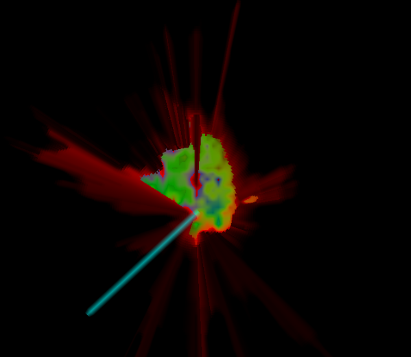

# Flow Field dynamics test

every point is a value from 0 to 1.  The point is scaled by 8 pi to get a direction (which gives several turns possible within the same range).

A/D keys turn, and W/S speed up/slow down.

the angle from 'here' to 'there' is computed form the dot product of the vector to 'there' and the vector from the angle above...

If the vector opposes 'forward' then it is colored in red, otherwise it is green.

You are autmatically accelerated if facing in the direction of the vector field, otherwise you are stopped...

Green areas will move you more forward.

